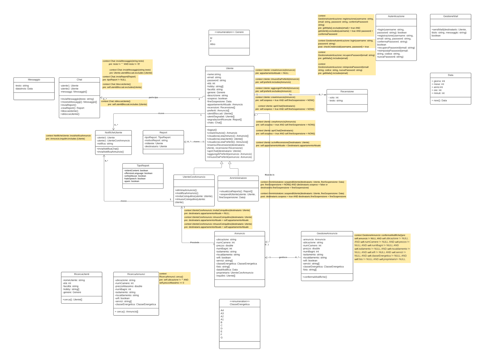

<h2 align="center">APPartamenti</h2>

<div align="center">

[](/LICENSE)

</div>

---

<p align="center"> 
    Questo è il progetto realizzato dal gruppo G47 per la deliverable 5 di Ingegneria del software, a.a. 2021/2022.
    <br> 
</p>

## 📝 Table of Contents

- [About](#about)
- [Getting Started](#getting_started)
- [Avvio applicazione](#deployment)
- [Uso del sito](#usage)
- [Built Using](#built_using)
- [Autori](#authors)

## 🧐 About <a name = "about"></a>

Il sito "APPartamenti" consiste in una piattaforma per condividere annunci di appartamenti per cercare coinquilini con cui convivere.

Permette anche ad utenti senza appartamento di cercare degli appartamenti nella loro zona con certi prerequisiti, e di vedere chi risiede già in un certo appartamento.

## 🏁 Getting Started <a name = "getting_started"></a>

Questo paragrafo contiene informazioni su come impostare il progetto per eseguirlo localmente.

### Prerequisites

* Node (with npm)
* MongoDB

### Installing

Il primo passo è clonare la repository per ottenere il codice:

```
git clone https://github.com/DeeJack/APPartamenti
```

Questo creerà la cartella contenente tutto il codice

## 🔧 Inserire stringa di connessione <a name = "connection"></a>

Bisogna creare, nella cartella principale del progetto, un file chiamato ".env" con una sola riga:
```
ATLAS_URI=
```
E dopo l'uguale inserire la stringa di connessione del database.

## 🎈 Usage <a name="usage"></a>

Il sito consiste in alcune delle pagine principali che permettono di dare una panoramica del sito.
La parte di backend comprende alcune API REST che restituiscono dei dati in JSON. 

## 🎈 API <a name="api"></a>
Le API comprendono:
* GET /annunci/: restituisce la lista completa degli annunci
* POST /annunci/: aggiunge un annuncio fornendogli i campi
* DELETE /annunci/:id: elimina un annuncio fornendogli un ID
* PUT /annunci/:id: modifica un annuncio fornendogli un ID
* GET /users/: restituisce la lista completa degli utenti
* GET /users/:id: restituisce l'annuncio di cui è proprietario l'utente con qull'ID
* POST /users/: aggiunge un utente
* GET /roles/: restituisce i ruoli presenti (user, admin)
## 🚀 Avvio applicazione <a name = "deployment"></a>

Per avviare l'applicazione usare i seguenti comandi dalla cartella principale dell'applicazione:

Per installare le dipendenze:
```
npm install
```
Per avviare l'applicazione:
```
node app.js
```


## ⛏️ Built Using <a name = "built_using"></a>

- [MongoDB](https://www.mongodb.com/) - Database
- [Express](https://expressjs.com/) - Server Framework
- [NodeJs](https://nodejs.org/en/) - Server Environment
- [Javascript](https://www.javascript.com/) - Programming language

## ✍️ Authors <a name = "authors"></a>
Team G47:

- [Lorenzo Fumi](https://github.com/DeeJack)
- [Elisabetta Provvedini](https://github.com/eprovvedini)
- [Giovanni Zeni](https://github.com/GioZeni)

## UML



ReadME template by: [kylelobo](https://github.com/kylelobo/The-Documentation-Compendium)